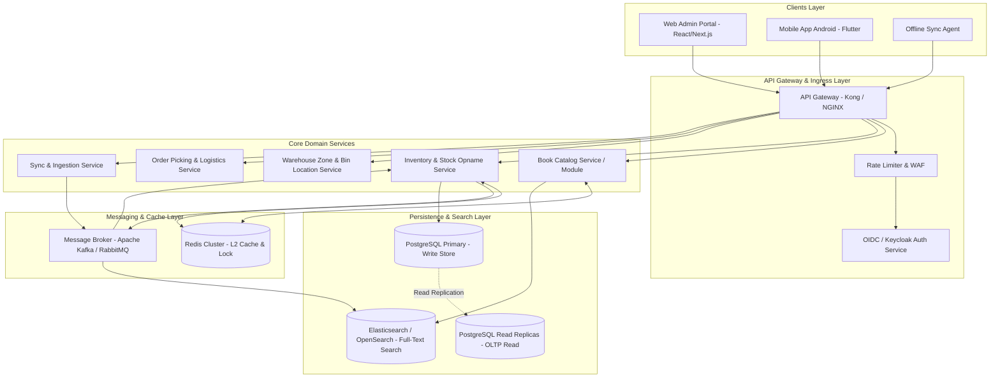
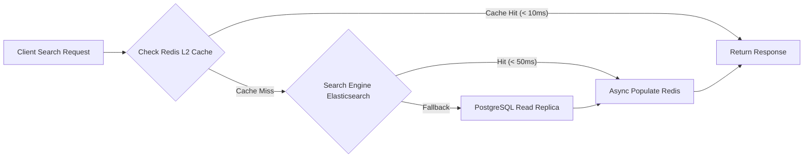
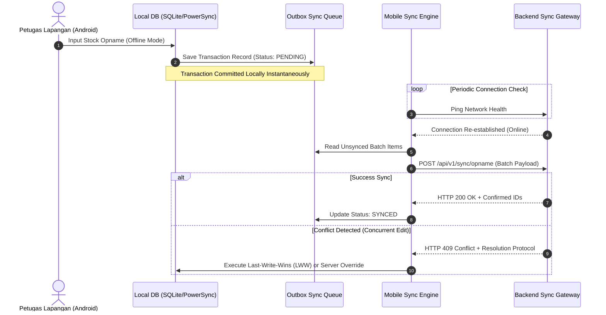
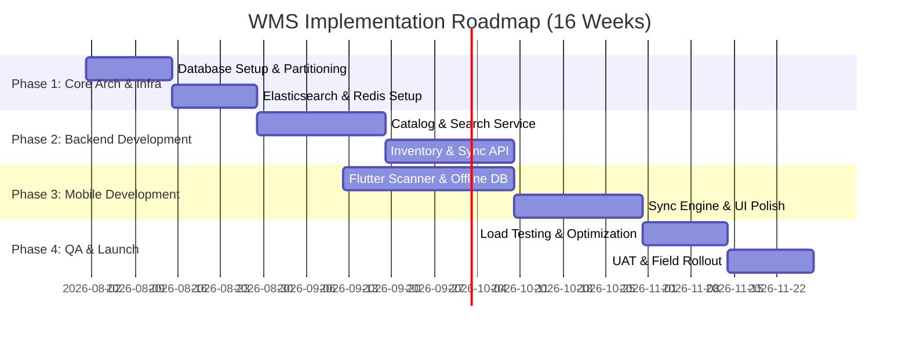

# Architectural Blueprint & Technical Implementation Guide: Enterprise Book WMS (Warehouse Management System)

Sistem Management Gudang Buku skala besar yang dirancang untuk menangani **jutaan data katalog & inventaris** dengan pertumbuhan pesat, akses multi-platform (Web Admin PC + Mobile App Android untuk petugas lapangan), latency pencarian **< 200ms**, dan dukungan **Offline-First**.

---

## 1. SOFTWARE ARCHITECTURE BLUEPRINT (Principal Software Architect)

### 1.1 Architectural Pattern: Event-Driven Modular Monolith to Microservices Evolution
Untuk sistem berskala jutaan data dengan kompleksitas inventaris, pendekatan awal yang disarankan adalah **Modular Monolith berbasis Clean Architecture (Domain-Driven Design / DDD)** yang disiapkan (*microservice-ready*) untuk dengan mudah dipecah menjadi Microservices independen seiring pertumbuhan beban data.



#### Core Domain Services Separation:
1. **Book Catalog Service**: Pengelolaan metadata buku, ISBN, penulis, penerbit, kategori, dan pencarian cepat.
2. **Inventory & Stock Opname Service**: Pengelolaan kuantitas stok realtime, bin/rack location, mutasi barang, audit opname, dan safety stock alert.
3. **Warehouse Location Service**: Mapping denah gudang (Zone, Rack, Shelf, Bin ID).
4. **Offline Sync Engine**: Menangani *outbox pattern*, resolusi konflik data, dan sinkronisasi batch dari perangkat mobile.

---

### 1.2 Recommended Technology Stack

| Layer | Teknologi Utama | Alasan Pemilihan & Peran |
| :--- | :--- | :--- |
| **Primary Database (OLTP)** | **PostgreSQL 16+** | Konsistensi ACID tinggi untuk transaksi stok, dukungan *JSONB*, *Partitioning*, dan *Row-Level Locking* (`FOR UPDATE`). |
| **Search Engine (OLAP)** | **Elasticsearch / OpenSearch** | Inverted Index untuk pencarian judul, penulis, dan ISBN dengan latency < 50ms untuk puluhan juta record. |
| **Caching Layer** | **Redis Cluster 7.x** | In-memory key-value store untuk query caching, session storage, serta *Distributed Lock* (Redlock) mencegah race-condition persediaan stok. |
| **Message Broker** | **Apache Kafka / RabbitMQ** | Asynchronous event streaming untuk pemrosesan event stok opname, pengkinian index Elasticsearch, dan notifikasi stok menipis. |
| **Backend Framework** | **Go (Golang) / NestJS (TypeScript)** | Performansi tinggi, penggunaan memori efisien, penanganan konkurensi goroutine/async IO yang handal. |
| **Mobile App (Android)** | **Flutter 3.x (Dart)** | Performa mendekati native, kompilasi AOT, integrasi plugin kamera/barcode scanner efisien, dan manajemen state BLoC. |
| **Web Admin** | **React / Next.js (TypeScript)** | Server-side rendering (SSR), dashboard interaktif cepat dengan antarmuka modern. |
| **Local Mobile DB** | **PowerSync / WatermelonDB (SQLite)** | Database lokal berefisiensi tinggi untuk pola *Offline-First* pada perangkat mobile. |

---

### 1.3 High-Scalability & Sub-200ms Search Performance Strategy

Untuk menjaga response time pencarian buku **di bawah 200ms** meskipun volume data mencapai puluhan juta record:



1. **CQRS (Command Query Responsibility Segregation) & Read/Write Segregation**:
   - Operations Write (Mutasi stok, penambahan buku) masuk ke **PostgreSQL Primary**.
   - Read / Search operations diarahkan penuh ke **Elasticsearch** dan **PostgreSQL Read Replicas**.
2. **Database Table Partitioning**:
   - Tabel `stock_movements` dan `book_inventories` dipartisi berdasarkan `zone_id` dan *Range Partitioning* tanggal (`created_at` per bulan/tahun).
3. **Elasticsearch Indexing Optimization**:
   - Penggunaan custom analyzer (Edge N-gram) untuk *autocomplete* pencarian judul buku & ISBN.
   - Index sharding (3 primary shards, 1 replica shard per 10 juta dokumen).
4. **Multi-Level Caching**:
   - **L1 Cache (In-Memory Microservice)**: Cache lokal singkat (TTL 5 detik) untuk query terpopuler.
   - **L2 Cache (Redis Cluster)**: Cache hasil query pencarian dengan kunci `hash(query_params)` (TTL 5 - 15 menit, invalidasi berbasis Kafka events saat ada mutasi katalog).

---

## 2. DEVELOPER IMPLEMENTATION GUIDE & CODE (Senior Full-Stack Developer)

### 2.1 Project Folder Structure

#### A. Backend Architecture (Clean / Hexagonal Architecture - NestJS / Go style)
```text
backend-wms/
├── src/
│   ├── config/                   # Configuration loaders & env validation
│   ├── core/                     # Common interfaces, base entities, guard, interceptors
│   │   ├── domain/               # Aggregate roots, Entities, Value Objects
│   │   ├── use-cases/            # Application business rules
│   │   └── adapters/             # Interface contracts (Ports)
│   ├── infrastructure/           # Outer layer (Frameworks & Drivers)
│   │   ├── database/             # TypeORM/Prisma entities, migrations, partitioning scripts
│   │   ├── cache/                # Redis client & caching strategy
│   │   ├── search/               # Elasticsearch client & mapping indices
│   │   ├── messaging/            # Kafka producers & consumers
│   │   └── http/                 # Express/Fastify controllers, DTOs, pipes
│   └── modules/
│       ├── catalog/              # Book Catalog Domain
│       │   ├── application/      # SearchBookUseCase, CreateBookUseCase
│       │   ├── domain/           # Book entity, ISBN value object
│       │   ├── infrastructure/   # ElasticsearchRepositoryImpl, PostgresBookRepo
│       │   └── presentation/     # BookController, DTOs
│       ├── inventory/            # Inventory & Stock Opname Domain
│       └── sync/                 # Mobile Offline Data Ingestion Domain
└── test/                         # Unit, Integration, and E2E Tests
```

#### B. Mobile App Architecture (Flutter - Feature-First Clean Architecture + BLoC)
```text
mobile_wms/
├── lib/
│   ├── core/
│   │   ├── network/              # Dio client, Interceptors, Connection Checker
│   │   ├── database/             # SQLite / Drift / PowerSync local DB setup
│   │   ├── theme/                # UI tokens, color system, typography
│   │   └── utils/                # Barcode parsers, formatters
│   ├── features/
│   │   ├── scanner/              # Barcode & QR Code Scanning Module
│   │   │   ├── presentation/     # CameraScannerScreen, ScannerBloc
│   │   │   └── domain/           # BarcodeValidationRule
│   │   ├── stock_opname/         # Stock Opname Module
│   │   │   ├── data/             # StockOpnameRepository, LocalDataSource, RemoteDataSource
│   │   │   ├── domain/           # StockItemEntity, SyncQueueModel
│   │   │   └── presentation/     # OpnameDetailScreen, StockOpnameBloc
│   │   └── sync/                 # Offline Sync Engine
│   │       ├── data/             # OutboxSyncRepository
│   │       └── logic/            # SyncBloc, ConflictResolver
│   └── main.dart
```

---

### 2.2 Production-Ready Code Implementation

#### A. Backend API Endpoint: Fast Book Search with Redis Caching & Cursor Pagination (TypeScript / Express Node.js)

```typescript
import { Request, Response } from 'express';
import { Redis } from 'ioredis';
import { Client as ESClient } from '@elastic/elasticsearch';

const redis = new Redis(process.env.REDIS_URL || 'redis://localhost:6379');
const esClient = new ESClient({ node: process.env.ELASTICSEARCH_URL || 'http://localhost:9200' });

interface SearchQueryDTO {
  query?: string;
  category_id?: string;
  zone_id?: string;
  cursor?: string; // Base64 encoded JSON string { last_id: string, last_score: number }
  limit?: number;
}

export class BookSearchController {
  public static async searchBooks(req: Request, res: Response): Promise<void> {
    try {
      const { query = '', category_id, zone_id, cursor, limit = '20' } = req.query as SearchQueryDTO;
      const parsedLimit = Math.min(parseInt(limit.toString(), 10) || 20, 100);

      // 1. Generate Unique Cache Key
      const cacheKey = `wms:search:${Buffer.from(JSON.stringify({ query, category_id, zone_id, cursor, limit: parsedLimit })).toString('base64')}`;

      // 2. Try L2 Redis Cache
      const cachedResult = await redis.get(cacheKey);
      if (cachedResult) {
        res.setHeader('X-Cache-Status', 'HIT');
        res.status(200).json(JSON.parse(cachedResult));
        return;
      }

      // 3. Decode Cursor Pagination
      let searchAfter: any[] | undefined = undefined;
      if (cursor) {
        try {
          searchAfter = JSON.parse(Buffer.from(cursor, 'base64').toString('utf-8'));
        } catch {
          res.status(400).json({ error: 'Invalid cursor format' });
          return;
        }
      }

      // 4. Build Elasticsearch Query
      const mustConditions: any[] = [];
      if (query.trim()) {
        mustConditions.push({
          multi_match: {
            query: query.trim(),
            fields: ['title^3', 'isbn^5', 'author^2', 'publisher'],
            fuzziness: 'AUTO'
          }
        });
      } else {
        mustConditions.push({ match_all: {} });
      }

      const filterConditions: any[] = [];
      if (category_id) filterConditions.push({ term: { category_id } });
      if (zone_id) filterConditions.push({ term: { 'inventory.zone_id': zone_id } });

      const esResponse = await esClient.search({
        index: 'wms_books_catalog',
        size: parsedLimit + 1, // Fetch N+1 to check if next page exists
        body: {
          query: {
            bool: {
              must: mustConditions,
              filter: filterConditions
            }
          },
          sort: [
            { _score: { order: 'desc' } },
            { id: { order: 'asc' } }
          ],
          ...(searchAfter ? { search_after: searchAfter } : {})
        }
      });

      const hits = esResponse.hits.hits;
      const hasNextPage = hits.length > parsedLimit;
      const itemsToReturn = hasNextPage ? hits.slice(0, parsedLimit) : hits;

      let nextCursor: string | null = null;
      if (hasNextPage && itemsToReturn.length > 0) {
        const lastItem = itemsToReturn[itemsToReturn.length - 1];
        nextCursor = Buffer.from(JSON.stringify(lastItem.sort)).toString('base64');
      }

      const responsePayload = {
        data: itemsToReturn.map((hit: any) => ({
          id: hit._id,
          ...hit._source
        })),
        pagination: {
          limit: parsedLimit,
          has_next_page: hasNextPage,
          next_cursor: nextCursor
        }
      };

      // 5. Write to Redis Cache (TTL 5 Minutes)
      await redis.setex(cacheKey, 300, JSON.stringify(responsePayload));

      res.setHeader('X-Cache-Status', 'MISS');
      res.status(200).json(responsePayload);
    } catch (error: any) {
      console.error('Book Search Error:', error);
      res.status(500).json({ error: 'Internal Server Error during book search' });
    }
  }
}
```

---

#### B. Mobile App: High-Performance Barcode & QR Code Scanner (Flutter + `mobile_scanner`)

```dart
import 'package:flutter/material.dart';
import 'package:flutter/services.dart';
import 'package:mobile_scanner/mobile_scanner.dart';

class WarehouseBarcodeScannerScreen extends StatefulWidget {
  final Function(String barcode, String format) onBarcodeScanned;

  const WarehouseBarcodeScannerScreen({
    Key? key,
    required this.onBarcodeScanned,
  }) : super(key: key);

  @override
  State<WarehouseBarcodeScannerScreen> createState() => _WarehouseBarcodeScannerScreenState();
}

class _WarehouseBarcodeScannerScreenState extends State<WarehouseBarcodeScannerScreen> {
  final MobileScannerController _scannerController = MobileScannerController(
    detectionSpeed: DetectionSpeed.normal,
    facing: CameraFacing.back,
    torchEnabled: false,
    formats: [BarcodeFormat.ean13, BarcodeFormat.code128, BarcodeFormat.qrCode],
  );

  bool _isProcessing = false;

  void _handleBarcode(BarcodeCapture capture) async {
    if (_isProcessing) return;

    final List<Barcode> barcodes = capture.barcodes;
    if (barcodes.isEmpty) return;

    final Barcode barcode = barcodes.first;
    final String? rawValue = barcode.rawValue;

    if (rawValue != null && rawValue.isNotEmpty) {
      setState(() => _isProcessing = true);

      // Haptic Feedback for physical scanner feel
      HapticFeedback.mediumImpact();

      widget.onBarcodeScanned(rawValue, barcode.format.name);

      // Brief delay before scanning next barcode to avoid double triggers
      await Future.delayed(const Duration(milliseconds: 1200));
      if (mounted) {
        setState(() => _isProcessing = false);
      }
    }
  }

  @override
  void dispose() {
    _scannerController.dispose();
    super.dispose();
  }

  @override
  Widget build(BuildContext context) {
    return Scaffold(
      backgroundColor: Colors.black,
      appBar: AppBar(
        title: const Text('Scan ISBN / Barcode Rak'),
        backgroundColor: const Color(0xFF1E1E2E),
        actions: [
          IconButton(
            icon: ValueListenableBuilder(
              valueListenable: _scannerController.torchState,
              builder: (context, state, child) {
                return Icon(
                  state == TorchState.on ? Icons.flash_on : Icons.flash_off,
                  color: state == TorchState.on ? Colors.yellow : Colors.grey,
                );
              },
            ),
            onPressed: () => _scannerController.toggleTorch(),
          ),
        ],
      ),
      body: Stack(
        children: [
          MobileScanner(
            controller: _scannerController,
            onDetect: _handleBarcode,
          ),
          // Viewport Overlay Focus Area
          Center(
            child: Container(
              width: MediaQuery.of(context).size.width * 0.8,
              height: 220,
              decoration: BoxDecoration(
                border: Border.all(
                  color: _isProcessing ? Colors.green : Colors.cyanAccent,
                  width: 3,
                ),
                borderRadius: BorderRadius.circular(16),
                color: Colors.black.withOpacity(0.1),
              ),
            ),
          ),
          Positioned(
            bottom: 40,
            left: 0,
            right: 0,
            child: Center(
              child: Container(
                padding: const EdgeInsets.symmetric(horizontal: 24, vertical: 12),
                decoration: BoxDecoration(
                  color: Colors.black.withOpacity(0.75),
                  borderRadius: BorderRadius.circular(20),
                ),
                child: Text(
                  _isProcessing ? "Meprosos Data..." : "Arahkan kamera ke Barcode ISBN / Kode Rak",
                  style: const TextStyle(color: Colors.white, fontSize: 14),
                ),
              ),
            ),
          ),
        ],
      ),
    );
  }
}
```

---

### 2.3 Offline-First Mobile Data Synchronization Strategy

Di area *blank spot* gudang yang tidak terjangkau Wi-Fi/4G, sistem lapangan tetap harus berjalan 100% tanpa hambatan.



#### Alur Penanganan Offline-First:
1. **Local Transactional Write**:
   - Seluruh mutasi stok saat opname ditulis langsung ke SQLite lokal menggunakan pola **Transactional Outbox Pattern**.
2. **Idempotency Key Assignment**:
   - Setiap mutasi lokal diberi UUID v4 unik (`client_mutation_id`) sejak pertama kali dibuat di HP.
3. **Background Background Sync Queue**:
   - Penggunaan background worker (WorkManager di Android) yang mendeteksi perubahan status konektivitas jaringan secara otomatis.
4. **Server-Side Conflict Resolution (Last-Write-Wins with Ledger Audit)**:
   - Apabila dua petugas melakukan audit stok pada buku & rak yang sama saat offline, Backend menerima kedua mutasi dan mengeksekusi resolusi berbasis *Client Timestamp + Server Ledger Adjustments*.

---

## 3. QUALITY ASSURANCE & TESTING STRATEGY (Lead QA Engineer)

### 3.1 Automated Testing Strategy Pyramid

```text
       /\
      /  \     E2E Tests (10%) -> Flutter Patrol / Detox / Cypress
     /----\
    / Integration \  Integration Tests (30%) -> Jest + Supertest + Testcontainers (DB/Redis)
   /--------------\
  /   Unit Tests   \ Unit Tests (60%) -> Go Test / Jest / Dart Test (Domain Logic & Pure Functions)
 /------------------\
```

- **Unit Testing (Target: >85% Coverage)**: Pengujian logika bisnis inti (Kalkulasi perbedaan stok, validasi checksum ISBN-13, pembentukan kriteria pencarian).
- **Integration Testing**: Pengujian interaksi antar modul dengan *Testcontainers* (memutar Postgres & Elasticsearch temporer di Docker untuk memastikan query asli berjalan valid).
- **E2E Testing**: Pengujian alur utuh dari Mobile App hingga Web Admin dashboard.

---

### 3.2 Load & Performance Testing Script (k6)

Target: **10.000 RPS Search Requests** dengan p95 Response Time **< 200ms** dan Error Rate **< 0.1%**.

Save as `test/load/book_search_loadtest.js`:

```javascript
import http from 'k6/http';
import { check, sleep } from 'k6';
import { Rate, Trend } from 'k6/metrics';

// Custom Metrics
const searchLatency = new Trend('book_search_duration');
const errorRate = new Rate('book_search_error_rate');

export const options = {
  scenarios: {
    high_throughput_search: {
      executor: 'ramping-arrival-rate',
      startRate: 500,
      timeUnit: '1s',
      preAllocatedVUs: 1000,
      maxVUs: 5000,
      stages: [
        { duration: '1m', target: 2000 },   // Ramp-up to 2,000 RPS
        { duration: '3m', target: 10000 },  // Peak load: 10,000 RPS
        { duration: '5m', target: 10000 },  // Sustained load at 10k RPS
        { duration: '1m', target: 0 },      // Ramp-down
      ],
    },
  },
  thresholds: {
    'book_search_duration': ['p(95)<200', 'p(99)<400'], // 95% requests must complete within 200ms
    'book_search_error_rate': ['rate<0.001'],            // Error rate below 0.1%
  },
};

const BASE_URL = __ENV.TARGET_URL || 'http://localhost:3000/api/v1/books/search';

const SAMPLE_QUERIES = [
  'Algorithms', 'Pemrograman', '978-602-03-2412-1', 'Clean Code',
  'Fisika Kuantum', 'Arsitektur', 'Gudang', 'Database'
];

export default function () {
  const randomQuery = SAMPLE_QUERIES[Math.floor(Math.random() * SAMPLE_QUERIES.length)];
  const url = `${BASE_URL}?query=${encodeURIComponent(randomQuery)}&limit=20`;

  const params = {
    headers: {
      'Accept': 'application/json',
      'User-Agent': 'k6-load-testing-agent',
    },
    tags: { name: 'BookSearchURL' },
  };

  const res = http.get(url, params);

  // Measure metrics
  searchLatency.add(res.timings.duration);
  const success = check(res, {
    'status is 200': (r) => r.status === 200,
    'has valid pagination payload': (r) => {
      try {
        const body = JSON.parse(r.body);
        return body.data !== undefined && Array.isArray(body.data);
      } catch {
        return false;
      }
    },
  });

  errorRate.add(!success);

  // Pace requests per virtual user
  sleep(0.1);
}
```

---

### 3.3 Critical BDD Test Cases (Gherkin Format)

#### Feature 1: ISBN Barcode Scanning & Auto Location Lookup
```gherkin
Feature: Scan Barcode ISBN Buku di Gudang
  Sebagai Petugas Gudang Lapangan
  Saya ingin memindai barcode ISBN buku menggunakan kamera HP
  Agar lokasi rak dan sisa stok buku dapat ditemukan secara instant

  Scenario: Memindai ISBN buku yang terdaftar di katalog gudang
    Given Petugas gudang telah login ke aplikasi mobile WMS
    And Aplikasi berada pada layar "Scan Barcode"
    When Petugas mengarahkan kamera ke barcode ISBN "978-602-03-2412-1"
    Then Kamera berhasil membaca barcode dengan respons getaran haptic
    And Sistem menampilkan rincian buku:
      | Field        | Value                            |
      | Judul        | Clean Architecture versi Indonesia|
      | Rak Lokasi   | Z-01-R-04-B                      |
      | Sisa Stok    | 145 exemplar                     |
    And Waktu respon layar tampilan detail kurang dari 150 milidetik

  Scenario: Memindai barcode fisik yang rusak atau tidak dapat terbaca
    Given Petugas gudang berada pada layar "Scan Barcode"
    When Petugas mengarahkan kamera ke barcode fisik yang buram
    And Kamera gagal mendekode barcode dalam waktu 3 detik
    Then Aplikasi menampilkan pesan peringatan "Barcode tidak terbaca"
    And Aplikasi menyediakan tombol fallback "Input SKU / ISBN Manual"
```

#### Feature 2: Low Stock Warning & Automated Reorder Alert
```gherkin
Feature: Deteksi dan Notifikasi Stok Buku Menipis (Safety Threshold)
  Sebagai Supervisor Gudang
  Saya ingin menerima notifikasi otomatis ketika stok fisik buku di bawah ambang batas minimum
  Agar proses restock/reorder ke penerbit dapat segera diproses

  Scenario: Stok berkurang hingga melewati ambang batas safety stock
    Given Buku "Algoritma Pemrograman" memiliki Safety Threshold sejumlah 10 exemplar
    And Stok fisik saat ini di gudang berjumlah 11 exemplar
    When Terjadi mutasi pengeluaran stok sebanyak 2 exemplar untuk pesanan "ORD-99182"
    Then Sisa stok fisik buku diperbarui menjadi 9 exemplar
    And Sistem secara otomatis mengubah status inventaris buku menjadi "CRITICAL_LOW"
    And Event "INVENTORY_SAFETY_THRESHOLD_REACHED" dikirimkan ke Message Broker
    And Web Admin Portal menerima notifikasi alert merah pada dashboard inventaris secara realtime
```

#### Feature 3: Concurrent Stock Mutex Locking (Race Condition Prevention)
```gherkin
Feature: Mencegah Discrepancy Stok Saat Pengambilan Barang Bersamaan
  Sebagai Sistem Pengelola Stok WMS
  Saya harus mengunci baris data stok saat dua proses pengambilan barang terjadi bersamaan
  Agar jumlah stok fisik tidak bernilai negatif (Over-allocation)

  Scenario: Dua petugas melakukan pengambilan stok pada item yang sama secara simultan
    Given Buku ID "BK-8801" memiliki sisa stok 1 exemplar di Rak "A-02"
    When Petugas A dan Petugas B mengirimkan permintaan pengurangan 1 exemplar secara bersamaan
    Then Sistem mengeksekusi distributed lock (Redis Redlock) untuk Buku ID "BK-8801"
    And Permintaan Petugas A berhasil diproses dengan sisa stok menjadi 0
    And Permintaan Petugas B ditolak dengan pesan kesalahan "Stok barang tidak mencukupi"
    And Sisa stok akhir tetap konsisten di angka 0 (tidak negatif)
```

#### Feature 4: Offline Stock Opname Batch Data Synchronization
```gherkin
Feature: Sinkronisasi Data Opname Offline Saat Kembali Online
  Sebagai Petugas Gudang Lapangan
  Saya ingin data opname yang dicatat saat offline otomatis tersinkronisasi
  Agar tidak ada data pemeriksaan fisik yang hilang saat koneksi internet pulih

  Scenario: Sinkronisasi batch transaksi opname tanpa konflik data
    Given Petugas telah mencatat 15 item stock opname dalam mode offline
    And 15 data transaksi tersimpan di database lokal HP dengan status "PENDING_SYNC"
    When Perangkat Android terhubung kembali ke jaringan Wi-Fi gudang
    Then Mobile Sync Engine mengirimkan batch request ke Backend Sync Gateway
    And Backend mengembalikan respon HTTP 200 OK dengan daftar UUID yang terkonfirmasi
    And Status 15 data transaksi di HP berubah menjadi "SYNCED"
    And Dashboard Web Admin menampilkan total audit stok terbaru hasil sinkronisasi
```

---

## 4. SUMMARY IMPLEMENTATION ROADMAP


